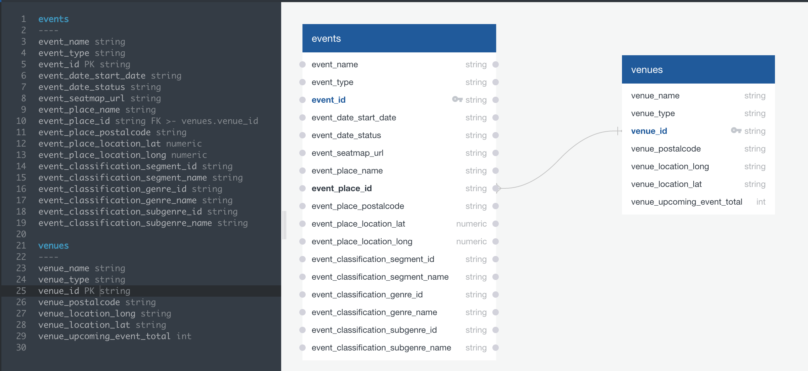

# the_show_must_go_on
**Topic:**  The Show Must Go On!  We’re trying to make show-hunting as easy as possible for Portland consumers.

**Team and Roles:** 
- Michael _Leaflet and maps_
- Erin _Python, SQL_
- Charles _Flask, JavaScript, Chartjs_
- Alana _HTML, CSS_

**Data source:** [Ticketmaster API](https://developer.ticketmaster.com/products-and-docs/apis/getting-started/)

**Repo name:** https://github.com/ekkross/the_show_must_go_on

We used TicketMaster’s API to get data about venues and events in Portland.
We then cleaned our data using Python and Pandas and loaded it into a Postgres database.

Next, we created interactive maps and charts using JavaScript, Chartjs, Node.js, and Leaflet (for maps).  These visualizations are interactive to allow users to change the view of said charts based on the data they choose to see.

The visualizations we created are:
A map of Portland's event venues with multiple filtering methods to update the data displayed
Bar charts representing genre and venue information

**About:**
We set out to create a way to find the right venue based on the type of show a person wanted to see.  You want to see a metal show on a Friday night?  Your best best to find a show is Dante’s or the Jack London Revue.  Opera?  Try the Newmark Theatre.  Comedy?  Go to the Keller.  
As we reviewed the TicketMaster API to see what other interesting data points we could get, we discovered that we could get the location of all of these venues as latitude and longitude in order to display them on a map.  
We also wanted to show the number of events by genre per venue to support our original question.

**Database Diagram:**
